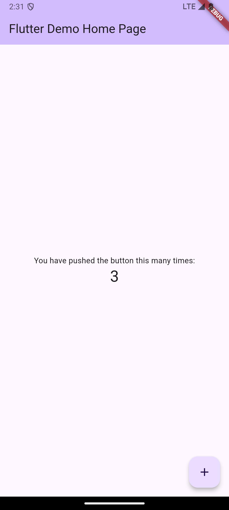
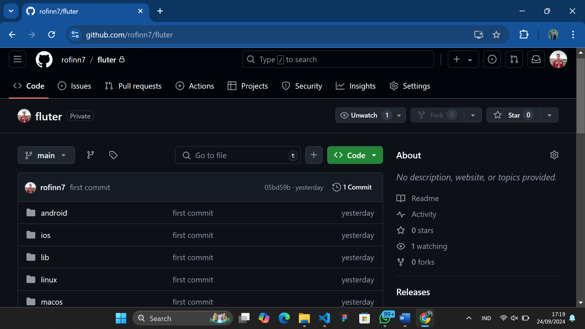
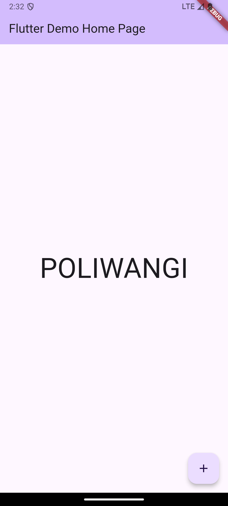
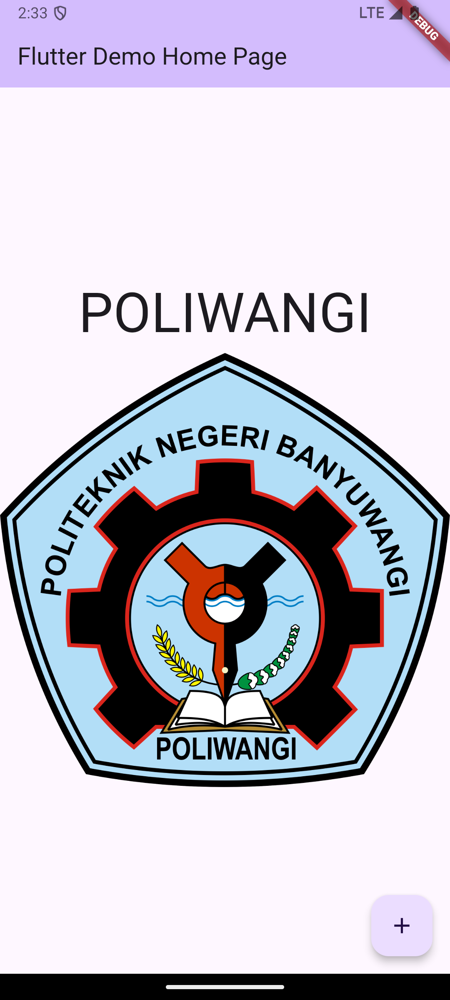
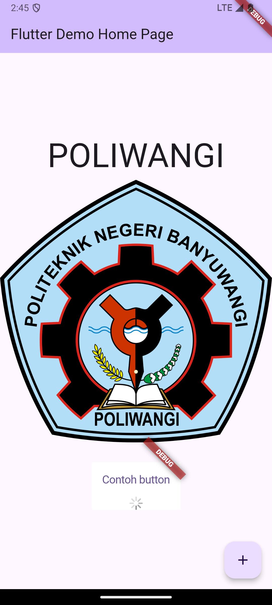
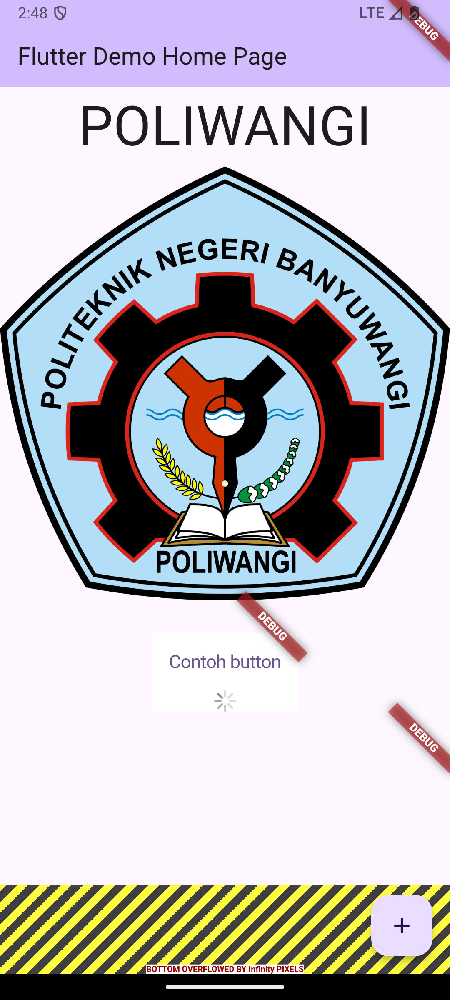
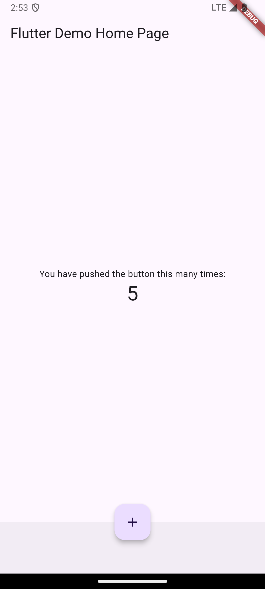
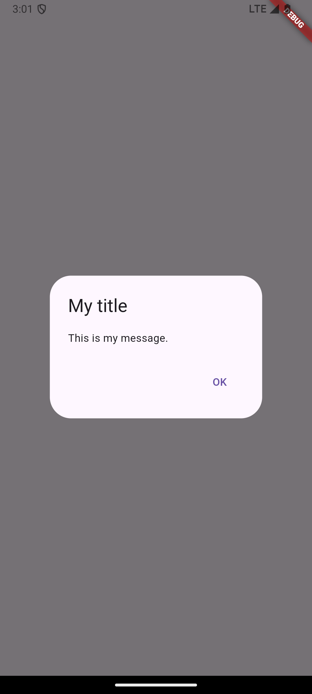
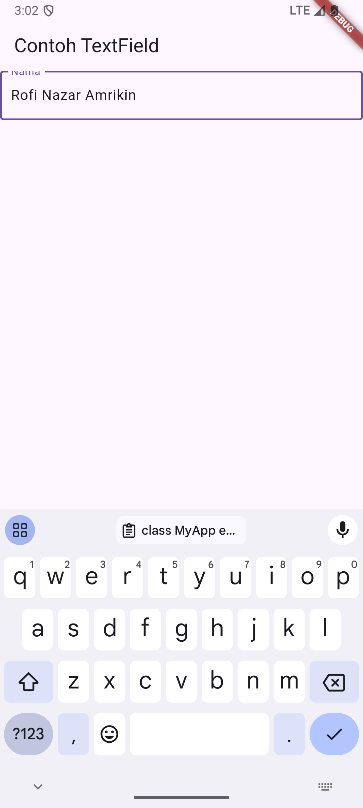
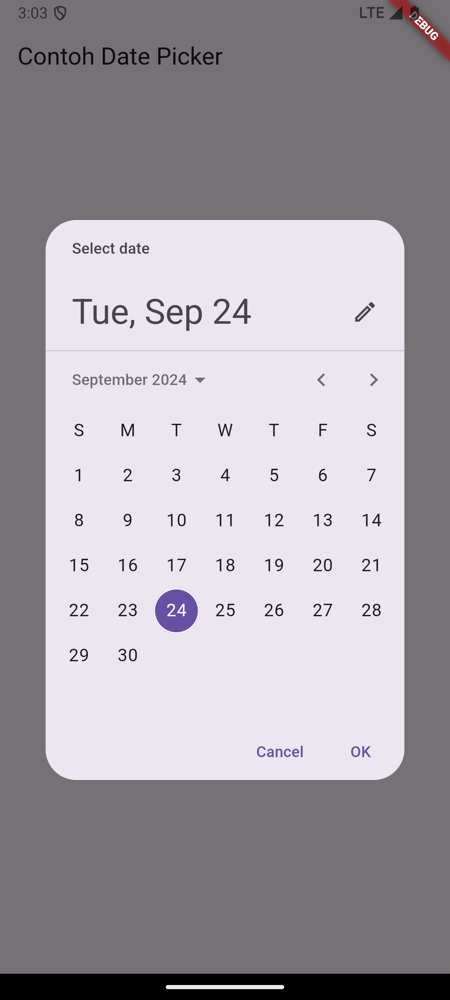

1. Praktikum 1 Membuat Project Flutter Baru
    

2. Praktikum 2 Membuat Repository GitHub dan Laporan Praktikum
    

3. Praktikum 3  Menerapkan Widget Dasar
    

    

4. Praktikum 4 Menerapkan Widget Material Design dan iOS Cupertino
    

    

    

    

    

    
